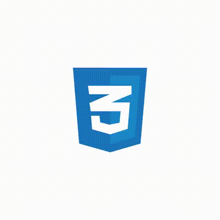
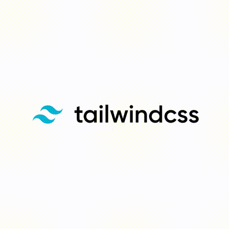
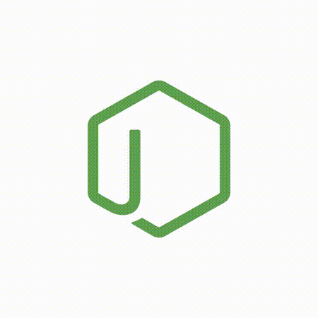
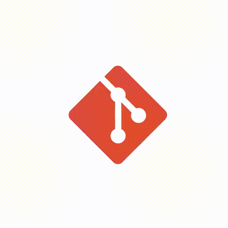

 

  

- 🔭 I’m currently working on [Taskilio](https://www.github.com/DeependraParmar/Taskilio.git)

- 🌱 I’m currently learning **MERN Stack, Machine Learning & DSA**

- 👯 I’m looking to collaborate on [Taskilio](https://www.github.com/DeependraParmar/Taskilio.git)

- 👨‍💻 All of my projects are available at [https://deependraparmar.vercel.app](https://deependraparmar.vercel.app)

- 💬 Ask me about **DSA & Development**

- 📫 How to reach me **deependraparmar1@gmail.com**

- 📄 Know about my experiences [https://www.linkedin.com/in/deependraparmar](https://www.linkedin.com/in/deependraparmar)

 
<h2 align="left">Connect with me 📞:</h2>

<kbd></kbd>
<kbd></kbd>
<kbd></kbd>
<kbd></kbd>
<kbd></kbd>
<kbd></kbd>

 

<h2 align="left">My Coding Profiles:</h2>

<kbd></kbd>
<kbd></kbd>
<kbd></kbd>
<kbd></kbd>

 

<h2 align="left">Languages I Code In 🔥:</h2>

<kbd></kbd>
<kbd></kbd>
<kbd></kbd>
<kbd></kbd>
<kbd></kbd>

  

<h2 align="left">My Development Skills 🔥:</h2>

<kbd></kbd>
<kbd></kbd>
<kbd></kbd>
<kbd></kbd>
<kbd></kbd>
<kbd></kbd>
<kbd></kbd>

  

  <h2 align="left">Support💁‍♂️♥:</h2>

  

 

  <h2 align="left">Github Trophies🏆🌟✨:</h2>

  
 <be>

<h2 align="left">Github Statistics💹🤵: </h2>

<!---->

<h2 align="left">Languages & Tools🚗🎉: </h2>

